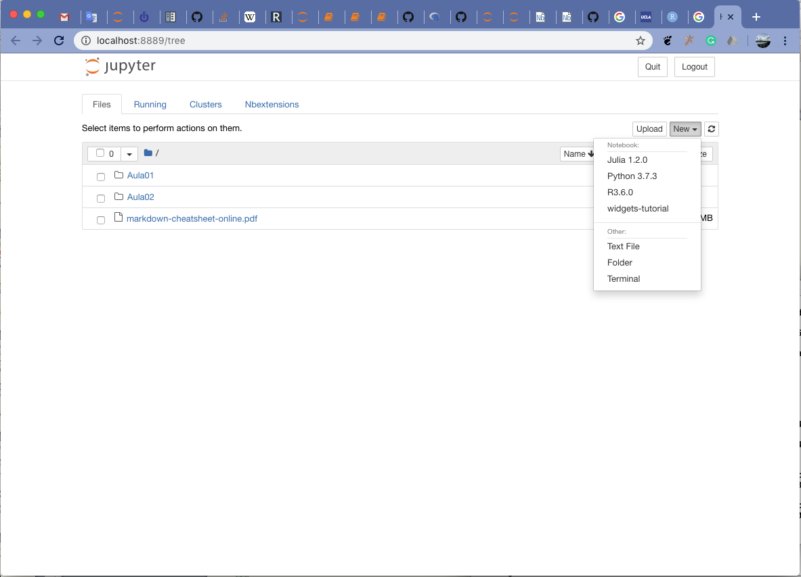

# Como instalar R, RStudio e Jupyter Notebook

## Introdução
Ao longo deste curso, **Bioestatística em R  para Métodos Diagnósticos de Medicina**, utilizaremos o software estatístico   associado a dois ambientes interativos para desenvolvimento de programas e análise de dados estatísticos. Além de apresentar conceitos e instrumentos estatísticos aplicados a dados em medicina, nosso intuito é instrumentar e torná-los capazes de desenvolver e aplicar os conceitos de reproducibilidade na análise estatística nas ciências experimentais, incluindo a ciência médica. Segue uma breve descrição desses três programas:

1.  é uma linguagem computacional e ambiente integrado para cálculo científico voltada para resolução de problemas em estatística com grande capacidade e flexibilidade para criação de gráficos científicos com qualidade de publicação. R é o resultado de um longo trabalho colaborativo de cientistas iniciado em 1997 no Departamento de Estatística da Universidade de Auckland na Nova Zelândia, que foi dado continuidade por centenas e milhares de colaboradores da comunidade internacional. R se tornou a língua franca computacional entre os estatísticos e muitos cientistas de dados (ou _data scientists_) no mundo todo ([O que é R? / What is R?](https://www.r-project.org/about.html)). Além de contar com um continuado processo de aprefeiçoamento e correção dos programas, as potencialidade do R são complementadas por publicações de bibliotecas ou pacotes ("packages") em códigos abertos e livres que estendem e acrescentam novos métodos de análises estatísticos. Por ser de código aberto e livre, esses pacotes são testáveis e checáveis por seu pares estatísticos, pesquisadore e usuários.
2.  é um ambiente integrado de desenvolvimento que provê facilidades no uso de R para análise, processamento de dados e documentação pelo uso do **R Markdown**, bem como para desenvolvimento de programas em R. RStudio é um produto desenvolvido pela empresa de mesmo nome [RStudio](https://www.rstudio.com) e uma de suas versões é aberta e gratuita.
3. O terceiro instrumento é o Jupyter Notebook, que, como diz o nome, é um ambiente com interface via navegador em forma de caderno de notas em que se pode mesclar anotações e códigos de programs, bem como incluir resultados de análises em sequências de operações ou comandos em R que são anotadas ao longo do caderno, **notebook**. Talvez o aspecto mais interessante dos recursos incorporados no **Jupyter Notebook** e mais recentemente **Jupyter Lab* são os modernos ambientes interativos baseados no **web** que pode ser acessado ou reproduzido em qualquer browser/navegador moderno para análise ou visualização das análises científicas em computador local ou remotamente em servidores e recursos computacionais localizados nas nuvens. O notebook é um documento que pode conter códigos, equações, gráficos e figuras para visualização e narrativas em texto, vídeo ou animações no qual se pode mostrar e documentar claramente as sequências de operações realizadas para análise e manipulação dos dados de modo que outras pessoas poderão reproduzir estas análises realizadas. O uso do Jupyter não está restrito ao uso da linguagem R. Atualmente ele suporta várias dezenas de linguagens computacionais, tais como Python, Matlab, Julia, C, C++, etc, a lista completa de "kernel" de Jupyter pode ser vista [aqui](https://github.com/jupyter/jupyter/wiki/Jupyter-kernels).


## Instalação dos três programas
Há vários caminhos para instalação inicial dos três programas. Em geral este roteiro dever funcionar em qualquer máquina com processador de 64 bits nos três sistemas operacionais mais populares — Windows, Mac OSX e Linux —, mas há sempre uma possibilidade de dar algo errado na instalação devido à complexidade desses sistemas computacionais. O processo de instalação foi testado com  sucesso em máquinas com Windows, mas deve funcionar também em Mac OSX e Linux.

### Roteiro para instalação de R, RStudio e Jupyter usando Miniconda

Para uso exclusivo de R, recomenda-se usar o Miniconda para administrar e instalar Os passos seguintes para instalação do Miniconda foram tirados deste [site](https://docs.conda.io/projects/conda/en/latest/user-guide/install/windows.html), onde há mais detalhes e opções de instalação,  inclusive do Anaconda. Há instruções também de como **desinstalar o Miniconda**.
***
#### 1. Instalando Miniconda
Miniconda é uma versão mais enxuta do Anaconda, que mostrado como instalar no primeiro dia de Aula na sala e se usou o Anaconda Navigator para se criar  um ambiente linguagem R, e depois instalar Jupyter Notebook e RStudio. Esperamos que o caminho que tomaremos aqui seja mais curto e robusto na conclusão. A instalação será mais enxuta, i.e. tomará bem menos espaço em disco que a instalação completa via Anaconda. 

* **Passo 1.** Certifique-se de que sua máquina está rodando uma versão Windows de 64 bits ([este site explica como verificar isso](https://www.lifewire.com/am-i-running-a-32-bit-or-64-bit-version-of-windows-2624475)). Todos os computadores modernos usam processadores de 64 bits.  Baixe o instalador do site do [Miniconda](https://conda.io/miniconda.html) ou use o link seguinte para baixar diretamente [Miniconda3-latest-Windows-x86_64.exe](https://repo.anaconda.com/miniconda/Miniconda3-latest-Windows-x86_64.exe). Para aquele que estiver usando máquinas antigas e rodando versão de Windows de 32 bits, baixe esta outra versão de [Miniconda para Windows 32 bits](https://repo.anaconda.com/miniconda/Miniconda3-latest-Windows-x86.exe). Verifique onde  o arquivo foi salvo, começando pelo no diretório "\Home\Downloads". Verifique isso via **Explorador de Arquivos** do Windows.

* **Passo 2.** Execute o instalador clicando o arquivo Miniconda-xxx-Windows-xxx.exe. Talvez você precise executar este passo, bem como as seguintes instalações **com direito de Administrador da máquina**. Neste caso, clique o arquivo Miniconda-xxx-Windows-xxx.exe com o botão direito do mouse e escolha executar como Administrator.
    
* **Passo 3.** Teste a instalação. Clique a janela de terminal ou procure por Anaconda prompt no menu do Windows (**da mesma forma que no Passo 2, abra o terminal como Administrador**). No terminal execute  > **conda list**. Com isso você deve estar vendo uma lista dos pacotes já instalados. Os nomes de pacotes iniciados com prefixo "r-" são pacotes ou bibliotecas do R e os outros são da linguagem Python, que é automaticamente instalado com Miniconda ou Anaconda. Se o comando **conda list** executado no terminal não gerou mensagem de erro, a instalação realizada no **Passo 2** foi finalizada com sucesso.
***    
#### 2. Instalando R e seus pacotes essenciais
    
* **Passo 4.** Ainda no Terminal execute
    
    **> conda install -c conda-forge r-base**
    
    Se terminou com sucesso, instale os pacotes essenciais do R
    
    **> conda install -c r r-essentials**
    
    Para verificar a instalação execute no terminal
    
    **> R**
    
    Se foi instalado adequadamente, você deve estar vendo uma mensagem no terminal começando por 
    
    > R version 3.6.1 (2019-07-05) -- "Action of the Toes"
Copyright (C) 2019 The R Foundation for Statistical Computing
Platform: x86_64-w64-mingw32/x64 (64-bit)
    
    > R is free software and comes with ABSOLUTELY NO WARRANTY.
You are welcome to redistribute it under certain conditions.
Type 'license()' or 'licence()' for distribution details.
    
    > (...)

    A versão deste R é 3.6.1, que foi disponibilizada e publicada no dia 05/julho/2019. Certifique-se de usar uma versão 3.6.0 ou superior. Como você pode ver, **R** é um "software livre", i.e. gratuito, mesmo para aplicações comerciais regido por estes termos de [licenças](https://www.r-project.org/Licenses/).
    
    RStudio Desktop que será instalado a seguir é também um produto gratuito, regida por "open source license" [AGPL v3](htps://pt.wikipedia.o tambémg/wiki/GNU_Affero_General_Public_License) e [vide site do RStudio](https://rstudio.com/products/rstudio/#rstudio-desktop) também para mais detalhes, porém desenvolvido e disponibilizado por uma empresa comercial com fins lucrativos que trabalha em estreita colaboração com a comunidade científica e de softwares. 
    
    Para sair do ambiente R, execute o commando quit() ou q() para podermos continuar com a instalação de RStudio e Jupyter Notebook
    ```{R}
    > quit()
    ```
    ou 
    ```{R}
    > q()
    ```
***
#### 3. Instalando RStudio Desktop
    
* **Passo 5.** Para instalar o RStudio, execute no Terminal,
    
    **> conda install -c r rstudio**
    
    Para verificar se a instalação foi reaizada a termo com sucesso, execute RStudio a partir do menu do Windows. Faça isso agora antes de prosseguir.

***
    
#### 4. Instalando Jupyter Notebook ou seu superconjunto, **Jupyter Lab**
    
* **Passo 6.** Utilizaremos o comando conda para instalar o ambiente Jupyter:
    **> conda install -c conda-forge jupyterlab
    
    Em cada uma das etapas de instalação, leia com cuidado as mensagens emitidas no Terminal para verificar se cada etapa da instalação ocorreu sem problemas ou com erros. 
    Verifique se a instalação foi realizada com sucesso executando [(vide manual)](https://jupyter-notebook-beginner-guide.readthedocs.io/en/latest/execute.html):
    
    **> jupyter notebook**
    
    Após uma breve lapso, você deverá estar observando em seu navegador preferido uma janela com o Jupyter Notebook:
    
<p>
<center>
    
</center>
</p>
    
Clique no botão **New** no canto superior direito, para o que deve aparecer opções de tipos de notebooks ou "kernels" do Jupyter, entre os quais você deve estar vendo **R**.
 
<p>
<center>
    
</center>
</p>

Pronto !

Para criar um notebook  clique na opção **R**. Se você já tiver arquivo de notebook do Jupyter disponível (que tem terminação "**.ipynb**") e quiser editá-lo ou visualizá-lo, você poderá abri-lo via janela de interface de arquivo (File), clicando no nome do arquivo listado para abri-lo.

**Importante**: não feche o terminal de comando por onde você iniciou o **jupyter notebook**, pois o seu fechamento **matará (kill)** os programas/processos iniciados a partir deste terminal que estão rodando na retaguarda para manter o notebook ativo no navegador, além do próprio programa **R**. Portanto mantenha o terminal aberto. Feche-o somente quando tiver terminado suas tarefas, salvo e fechado o notebook. 
***
Parabéns, você tem em mãos um poderoso ambiente de análise estatístico com o que poderá desfrutar dos recursos do R, RStudio e Jupyter, e por ora realizar os exercícios do nosso curso!  
