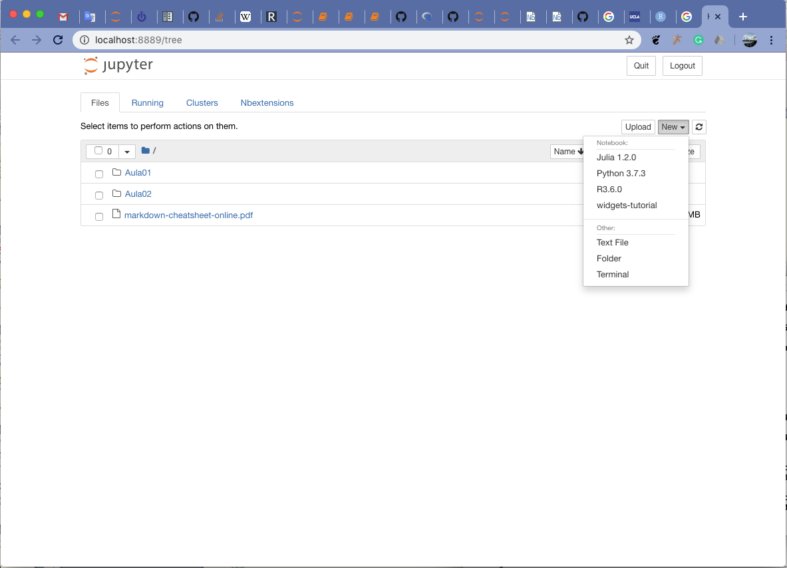

# Como instalar R, RStudio e Jupyter Notebook

## Introdução
Ao longo deste curso, Bioestatística em R  para Métodos Diagnósticos de Medicina utilizaremos um software estatístico,  , e dois ambientes interativos para desenvolvimento de programas em R e análise de dados estatísticos. Além de apresentar conceitos e instrumentos estatísticos aplicados a dados em medicina, nosso intuito é instrumentae os alunos a torná-los capazes de desenvolver e aplicar os conceitos de reproducibilidade na ciência experimental. Segue uma breve descrição desses três programas:

1.  é uma linguagem computacional e ambiente integrado para cálculo científico voltada para resolução de problemas em estatística com grande capacidade e flexibilidade para criação de gráficos científicos com qualidade de publicação. R é resultado de trabalho colaborativo por cientistas iniciado em 1997 no Departamento de Estatística da Universidade de Auckland na Nova Zelândia, e depois continuado por centenas e milhares de colaboradores no mundo todo. R se tornou uma espécie de língua franca entre os estatísticos e cientistas de dados (ou _data scientists_) [(What is R?)](https://www.r-project.org/about.html)
2.  é um ambiente integrado de desenvolvimento que fornece facilidades no uso de R para análise e processamento de dados, bem como de desenvolvimento de programas em R, que foi desenvolvido pela empresa de mesmo nome [RStudio](https://www.rstudio.com).
3. O terceiro recurso é o Jupyter Notebook, que como diz o nome é um ambiente em forma de caderno de notas em que se pode mesclar anotações e códigos de programs, bem como resultados de análises em que as sequências das operações em R, descrições, impressões são anotadas ao longo do **notebook**. Talvez o aspecto mais interessante dos conceitos desenvolvidos no Jupyter Notebook e mais recentemente Jupyter Lab são os modernos ambientes interativos baseados em web que pode ser rodado ou reproduzido em qualquer browser/navegador para análise ou visualização das análises científicas. O notebook é um documento que contém código, equações, visualizações e narrativas em que se pode mostrar claramente as sequencias de operações realizadas para análise dos dados de modo que qualquer pessoa poderá reproduzir as análises realizadas. 

## Instalação dos três programas
Há vários caminhos para instalação inicial desses três programas. Teoricamente este roteiro dever funcionar em qualquer máquina com processador de 64 bits nos três sistemas operacionais mais populares --- Windows, Mac OSX e Linux ---, mas há sempre possibilidade de dar algo errado. O processo de instalação foi testado com  sucesso em máquinas com Windows.

### Passos para instalação de R, RStudio e Jupyter usando Miniconda

Os passos seguintes para instalação do Miniconda foram tirados deste [site](https://docs.conda.io/projects/conda/en/latest/user-guide/install/windows.html), onde há mais detalhes e opções de instalação,  inclusive do Anaconda. Há instruções de como **desinstalar o Miniconda**.
***
#### 1. Instalando Miniconda
Miniconda é uma versão mais enxuta do Anaconda, que mostrado como instalar no primeiro dia de Aula na sala e se usou o Anaconda Navigator para se criar  um ambiente linguagem R, e depois instalar Jupyter Notebook e RStudio. Esperamos que o caminho que tomaremos aqui será mais curto e mais rápido. A instalação será mais enxuta, i.e. tomará bem menos espaço em disco. 

* **Passo 1.** Certifique-se de que sua máquina está rodando versão Windows de 64 bits ([este site explica como verificar isso](https://www.lifewire.com/am-i-running-a-32-bit-or-64-bit-version-of-windows-2624475)). Todos os computadores modernos usam processadores de 64 bits.  Baixe o instalador do site do [Miniconda](https://conda.io/miniconda.html) ou use o link seguinte para baixar diretamente [Miniconda3-latest-Windows-x86_64.exe](https://repo.anaconda.com/miniconda/Miniconda3-latest-Windows-x86_64.exe). Para aquele que estiver usando máquinas antigas e rodando versão de Windows de 32 bits, baixe esta outra versão de [Miniconda para Windows 32 bits](https://repo.anaconda.com/miniconda/Miniconda3-latest-Windows-x86.exe). Verifique onde  o arquivo foi salvo, começando pelo no diretório "\Home\Downloads". Verifique isso via **Explorador de Arquivos** do Windows

* **Passo 2.** Execute o instalador clicando o arquivo Miniconda-xxx-Windows-xxx.exe.
    
* **Passo 3.** Teste a instalação. Clique a janela de terminal ou procure por Anaconda prompt no menu do Windows. No terminal execute  > **conda list**. Com isso você deve estar vendo uma lista dos pacotes já instalados. Os nomes de pacotes iniciados com prefixo "r-" são pacotes ou bibliotecas do R e os outros da linguagem Python, que é automaticamente instalado com Miniconda ou Anaconda. Se o comando **conda list** executado no terminal não gerou mensagem de erro significa que a instalação realizada no **Passo 2** a foi realizada com sucesso.
***    
#### 2. Instalando R e seus pacotes essenciais
    
* **Passo 4.** Ainda no Terminal execute
    
    **> conda install -c conda-forge r-base**
    
    Se terminou com sucesso, instale os pacotes essenciais do R
    
    **> conda install -c r r-essentials**
    
    Para verificar a instalação execute no terminal
    
    **> R**
    
    Se foi instalado adequadamente, você deve estar vendo saída no terminal começando por 
    
    > R version 3.6.1 (2019-07-05) -- "Action of the Toes"
Copyright (C) 2019 The R Foundation for Statistical Computing
Platform: x86_64-w64-mingw32/x64 (64-bit)
    
    > R is free software and comes with ABSOLUTELY NO WARRANTY.
You are welcome to redistribute it under certain conditions.
Type 'license()' or 'licence()' for distribution details.
    
    > (...)

    A versão deste R é 3.6.1, que foi disponibilizado e publicada no dia 05/julho/2019. Certifique-se de usar uma versão 3.6.0 ou superior. Como você pode ver, **R** é um "software livre", i.e. é de gratuito, mesmo para aplicações comerciais regido por estes termos de [licenças](https://www.r-project.org/Licenses/).
    
    RStudio Desktop que será instalado a seguir é também um produto gratuito, regida por "open source license" [AGPL v3](htps://pt.wikipedia.o tambémg/wiki/GNU_Affero_General_Public_License) e [vide site do RStudio](https://rstudio.com/products/rstudio/#rstudio-desktop) também para mais detalhes, porém desenvolvido e disponibilizado por uma empresa comercial com fins lucrativos que trabalha em estreita colaboração com a comunidade científica e de softwares. 
    
    Para sair do ambiente R execute o commando quit() para podermos continuar com a instalação de RStudio e Jupyter Notebook
    
    **> quit()**
    
    ou 
    
    **> q()**
***
#### 3. Instalando RStudio Desktop
    
* **Passo 5.** Para instalar o RStudio execute no Terminal
    
    **> conda install -c r rstudio**
    
    Para verificar se a instalação foi reaizada a termo com sucesso, execute RStudio a partir do menu do Windows. Faça isso agora antes de proceder.

***
    
#### 4. Instalando Jupyter Notebook ou seu superconjunto, **Jupyter Lab**
    
* **Passo 6.** Utilizaremos o comando conda para instalar o ambiente Jupyter:
    **> conda install -c conda-forge jupyterlab
    
    Em cada uma das etapas de instalação leia com cuidados as mensagens para verificar se a instalação ocorreu sem problemas ou erros. 
    Verifique se a instalação foi realizada com sucesso executando [(vide manual)](https://jupyter-notebook-beginner-guide.readthedocs.io/en/latest/execute.html):
    
    **> jupyter notebook**
    
    Após algum tempo, você deverá estar observando em seu browser preferido uma janela com o Jupyter Notebook carregado:
    

    

    
    Clique no botão New no canto superior direito, para o que deve aparecer opções de tipos de notebooks, enter  os quais o "**R**".
 

    

    Pronto.

Para criar um notebook basta clicar na opção **R**. Por outro lado, se você já tiver arquivos de notebook do jupyter disponíveis (que têm terminação "**.ipynb**) poderá abrir via janela de interface de arquivo (File), bastando clicr para abri-lo.

**Importante**: não feche o terminal de comando por onde você inicializaou **jupyter notebook**, pois isso **mata (kill)** os programas que estarão rodando na retaguarda para manter o notebook ativo no navegador, além do próprio **R**. Deixe o terminal aberto. Feche-o somente quando terminar suas tarefas, salvando e fechando o notebook. 
***
Parabéns, você tem quase tudo que precisa para aprender R e realizar os exercícios do nosso curso. 
